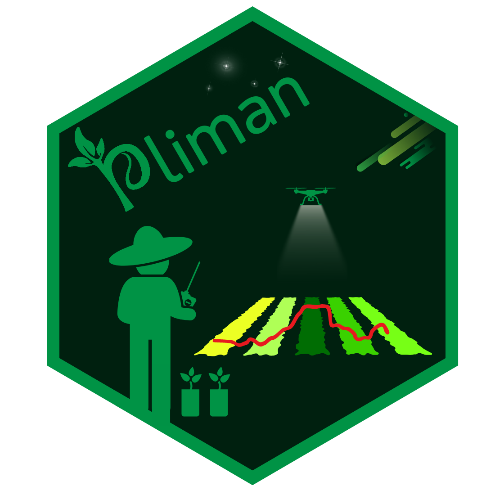

<!-- README.md is generated from README.Rmd. Please edit that file -->

```{r, echo = FALSE}
knitr::opts_chunk$set(
  collapse = TRUE,
  comment = "#",
  fig.path = "man/figures/README-",
  out.width = "100%"
)

```

# pliman 

<!-- badges: start -->

[](https://CRAN.R-project.org/package=pliman) [](https://lifecycle.r-lib.org/articles/stages.html#stable)  [](https://r-pkg.org/pkg/pliman) [](https://r-pkg.org/pkg/pliman) [](https://r-pkg.org/pkg/pliman) [](https://doi.org/10.32614/CRAN.package.pliman)

<!-- badges: end -->

The pliman package offers tools for both single and batch image manipulation and analysis ([Olivoto, 2022](https://onlinelibrary.wiley.com/doi/abs/10.1111/2041-210X.13803)), including the quantification of leaf area, disease severity assessment ([Olivoto et al., 2022](https://link.springer.com/article/10.1007/s40858-021-00487-5)), object counting, extraction of image indexes, shape measurement, object landmark identification, and Elliptical Fourier Analysis of object outlines, as detailed by Claude ([2008](https://link.springer.com/book/10.1007/978-0-387-77789-4)). The package also provides a comprehensive pipeline for generating shapefiles with complex layouts and supports high-throughput phenotyping of RGB, multispectral, and hyperspectral orthomosaics. This functionality facilitates field phenotyping using UAV- or satellite-based imagery.

`pliman` also provides useful functions for image transformation, binarization, segmentation, and resolution. Please visit the [Examples](https://nepem-ufsc.github.io/pliman/reference/index.html) page on the `pliman` website for detailed documentation of each function.

# Installation

Install the latest stable version of `pliman` from [CRAN](https://CRAN.R-project.org/package=pliman) with:

```{r, eval=FALSE}
install.packages("pliman")

```

The development version of `pliman` can be installed from [GitHub](https://github.com/nepem-ufsc/pliman) using the [pak](https://github.com/r-lib/pak) package:

```{r, eval=FALSE}
if(!requireNamespace("pak", quietly = TRUE)){
  install.packages("pak")
}
pak::pkg_install("nepem-ufsc/pliman")
```

*Note*: If you are a Windows user, you should also first download and install the latest version of [Rtools](https://cran.r-project.org/bin/windows/Rtools/).

# Analyze objects

The function `analyze_objects()` can be used to analyze objects such as leaves, grains, pods, and pollen in an image. By default, all measures are returned in pixel units. Users can [adjust the object measures](https://nepem-ufsc.github.io/pliman/articles/analyze_objects.html#adjusting-object-measures) with `get_measures()` provided that the image resolution (Dots Per Inch) is known. Another option is to use a reference object in the image. In this last case, the argument `reference` must be set to `TRUE`. There are two options to identify the reference object:

1.  By its color, using the arguments `back_fore_index` and `fore_ref_index`\
2.  By its size, using the arguments `reference_larger` or `reference_smaller`

In both cases, the `reference_area` must be declared. Let's see how to analyze an image with flax grains containing a reference object (rectangle with 2x3 cm). Here, we'll identify the reference object by its size; so, the final results in this case will be in metric units (cm).

```{r warning=FALSE, message=FALSE}
library(pliman)
img <- image_pliman("flax_grains.jpg")
flax <- 
  analyze_objects(img,
                  index = "GRAY",
                  reference = TRUE,
                  reference_larger = TRUE,
                  reference_area = 6,
                  marker = "point",
                  marker_size = 0.5,
                  marker_col = "red", # default is white
                  show_contour = FALSE) # default is TRUE
# summary statistics
flax$statistics

```

# Disease severity

## Using image indexes

To compute the percentage of symptomatic leaf area you can use the `measure_disease()` function you can use an image index to segment the entire leaf from the background and then separate the diseased tissue from the healthy tissue. Alternatively, you can provide color palette samples to the `measure_disease()` function. In this approach, the function fits a general linear model (binomial family) to the RGB values of the image. It then uses the color palette samples to segment the lesions from the healthy leaf.

In the following example, we compute the symptomatic area of a soybean leaf. The proportion of healthy and symptomatic areas is given as a proportion of the total leaf area after segmenting the leaf from the background (blue).

```{r}
img <- image_pliman("sev_leaf.jpg")
# Computes the symptomatic area
sev <- 
  measure_disease(img = img,
                  index_lb = "B", # to remove the background
                  index_dh = "NGRDI", # to isolate the diseased area
                  threshold = c("Otsu", 0), # You can also use the Otsu algorithm in both indexes (default)
                  plot = TRUE)
sev$severity
```

## Interactive disease measurements

An alternative approach to measuring disease percentage is available through the `measure_disease_iter()` function. This function offers an interactive interface that empowers users to manually select sample colors directly from the image. By doing so, it provides a highly customizable analysis method.

One advantage of using `measure_disease_iter()` is the ability to utilize the "mapview" viewer, which enhances the analysis process by offering zoom-in options. This feature allows users to closely examine specific areas of the image, enabling detailed inspection and accurate disease measurement.

```{r eval=FALSE}
img <- image_pliman("sev_leaf.jpg", plot = TRUE)

# works only in an interactive section
measure_disease_iter(img, viewer = "mapview")
```

# Deep Learning & Foundation Models

`pliman` integrates pre-trained Computer Vision and Deep Learning Foundation models running directly in C++ via Microsoft **ONNX Runtime**, with zero Python or PyTorch dependency. Models automatically execute with CPU multi-threading or hardware-accelerated Windows DirectML GPU support (`engine = "gpu"`).

Models are downloaded automatically on first use or manually via `pliman_download_model()`.

| Task / Capability | Function | Supported Models | Description |
|:---|:---|:---|:---|
| **Object Detection** | `image_detect_dl()` | `yolo26[n/s/m/l/x]` | Real-time object detection with bounding boxes (80 COCO classes). |
| **Instance Segmentation** | `image_segment_dl()` | `yolo26[n/s/m/l/x]-seg` | Real-time instance segmentation with continuous bilinear sub-pixel mask interpolation and 28 morphological features. |
| **Pose Estimation** | `image_pose_dl()` | `yolo26[n/s/m/l/x]-pose` | Real-time human pose estimation with 17 COCO keypoints and skeleton visualization. |
| **Image Classification** | `image_classify_dl()` | `yolo26[n/s/m/l]-cls` | Fast ImageNet 1,000-class image classification. |
| **Star-Convex Segmentation** | `image_stardist_dl()` | `stardist`, `stardist-dsb2018` | 48-ray star-convex polygon detection for round, convex, or touching grains, seeds, and cells. |
| **3D Depth Estimation** | `image_depth_dl()` | `depth-anything-v2` | Monocular 3D relative depth estimation (Depth Anything V2 Small, 518×518). |
| **Semantic Foundation Features** | `image_features_dl()` | `dinov2` | Dense 384-D patch embeddings and top-3 PCA false-color semantic segmentation via DINOv2 (ViT-S/14). |
| **4x Super-Resolution** | `image_superres_dl()` | `realesrgan-compact` | 4x generative convolutional super-resolution with memory-efficient tiled inference. |
| **Text-Prompted Segmentation** | `image_segment_dl()` | `grounded-sam` | Zero-shot open-vocabulary instance segmentation via Grounding DINO + SAM 2.1. |
| **One-Shot Exemplar Counting** | `image_segment_dl()` | `persam` | One-shot visual exemplar segmentation and counting via SAM 2.1 and Dense Conv ZNCC. |
| **Salient Background Removal** | `image_remove_bg()` | `ben2`, `u2netp`, `rmbg-2.0` | Ultra-sharp boundary cutouts and transparent background export. |

### 1. Real-Time Detection, Segmentation, Pose, and Classification (YOLO26)

```r
library(pliman)

img <- image_import("objects.jpg")

# Fast bounding box detection
boxes <- image_detect_dl(img, model = "yolo26n", conf_threshold = 0.25)

# High-resolution instance segmentation with polygon overlay
res_hl <- image_segment_dl(
  img,
  model = "yolo26n-seg",
  type = "highlight",
  box_threshold = 0.25,
  bbox = TRUE
)

# Single multi-label mask image with integer labels (0 = background, 1..N = instances)
res_mask <- image_segment_dl(img, model = "yolo26n-seg", type = "mask")

# Inspect morphological features (area, perimeter, circularity, etc.)
head(res_hl$features)

# Real-time pose estimation (17 COCO keypoints + skeleton)
pose_res <- image_pose_dl(img, model = "yolo26n-pose", conf_threshold = 0.3)

# 1,000-class ImageNet classification
top_classes <- image_classify_dl(img, model = "yolo26n-cls", top_k = 5)
```

### 2. Monocular 3D Depth Estimation (Depth Anything V2)

```r
# Computes relative 3D depth and displays with an inferno colormap
depth_img <- image_depth_dl(img, col_palette = "inferno")

# Access raw continuous depth values
raw_depth <- attr(depth_img, "depth")
```

### 3. Foundation Semantic Embeddings (DINOv2)

```r
# Extract 384-dimensional ViT patch embeddings and top-3 PCA false-color map
feats <- image_features_dl(img, return_pca = TRUE)

# Global image classification token vector
feats$cls_token
```

### 4. Star-Convex Polygon Segmentation (StarDist)

```r
# Ideal for crowded seeds, grains, or cell nuclei
grains <- image_import("grains.jpg")
res_star <- image_stardist_dl(grains, prob_threshold = 0.5)
```

### 5. Generative 4x Super-Resolution (Real-ESRGAN Compact)

```r
# Upscale low-resolution imagery by 4x with tiled memory-safe inference
img_4x <- image_superres_dl(img, scale = 4)
```

# Citation

```{r, comment=""}
citation("pliman")
```

# Getting help

If you come across any clear bugs while using the package, please consider filing a minimal reproducible example on [github](https://github.com/TiagoOlivoto/pliman/issues). This will help the developers address the issue promptly.

Suggestions and criticisms aimed at improving the quality and usability of the package are highly encouraged. Your feedback is valuable in making {pliman} even better!

# Code of Conduct

Please note that the pliman project is released with a [Contributor Code of Conduct](https://nepem-ufsc.github.io/pliman/CODE_OF_CONDUCT.html). By contributing to this project, you agree to abide by its terms.

